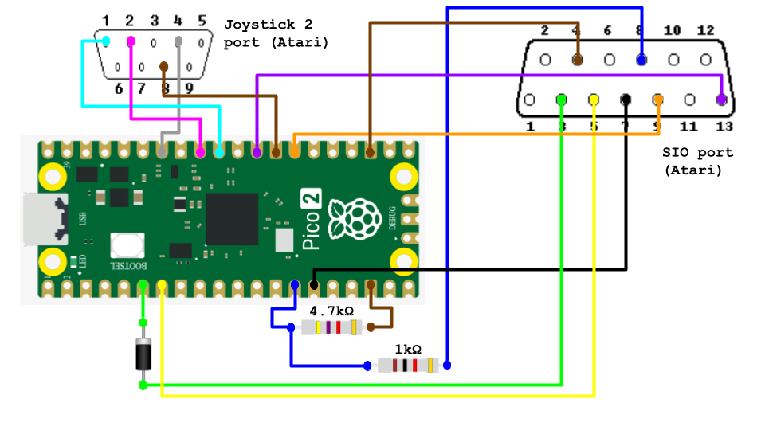
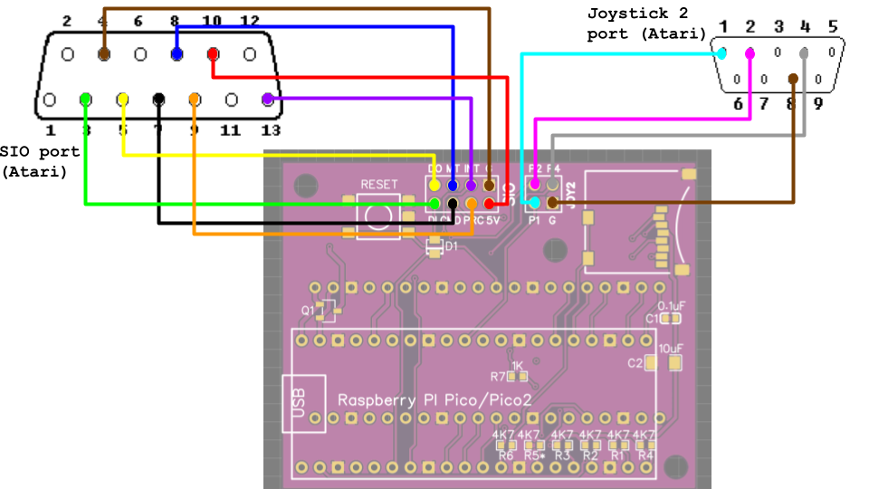

# a8-pico-sio

An Atari 8-bit SIO drive and (turbo) tape emulator for a [Raspberry Pi Pico (2)](https://www.raspberrypi.com/products/raspberry-pi-pico/)

## DISCLAIMER

**First and foremost** - connecting this device to your 8-bit Atari might be dangerous (especially when not done right) to your precious 8-bit retro equipment. You do all this at your own risk and I will not be held liable if you break or destroy anything. Also, I am not an electrical engineer, so I could have made some potentially disastrous assumptions or decisions in the project (I did try my best not to). Furthermore, read this README file in its entirety before using the device. Once again: **USE AT YOUR OWN RISK!**

In the following I also assume that you have basic knowledge of how the Atari 8-bit computer operates and that you can find out on the Internet how to install the Pico firmware by copying the UF2 file to your Pico board. I also assume that if you want to compile the firmware source code yourself you know how to go about it using your OS of choice (below I only give hints on how to target the different Pico boards).

## What is it?

This project is an Atari SIO drive emulator implemented on a Raspberry Pi Pico, similar in functionality to SDrive family of devices or SIO2SD. The first main motivation was to support loading of all kinds of turbo CAS tape images (not only the plain Atari SIO tape images, but all kinds that originally required the tape recorder hardware expansions like K.S.O. Turbo 2000, Turbo Blizzard, etc.) on a real Atari. (So far, the only actual device capable of that seems to be the AVG/SUBCart, but only through the SIO port's data lines, or the so far unpublished Bluetooth audio devices by Zaxxon, but these are mostly for WAV files.) Another driving force was to get acquainted with the Pico platform and the SIO protocol, hence a proper Dn: "classic" drive emulation was added too, with write and ATX support. Finally, I opted for a no driver program on the Atari side approach, but a (color) display based UI on the Pico side, and then also for a non-touch screen solution (I have been off-put by constant screen calibration problems on my SDrive-MAX).

What is **supported**:

* Loading of disk and tape image files from the Pico's internal FLASH (functioning as a USB drive when connected to a PC) or/and (at the same time) external SD card, with SD card hot-swapping.
* Four emulated disk drives D1: to D4: with buttons to quickly rotate them in either direction and one C: device.
* Image files: ATR - read and write (incl. formatting provided the size is a standard floppy one), ATX - read and limited write (only ATX existing sectors), no formatting, CAS - read of all CAS chunk types.
* XEX file loading, read-only through a virtual disk image with relocatable (from `$500` up to `$A00`) boot loader.
* Creation of empty or pre-formatted ATR images of standard sizes up to 360KB.
* ATX mode selectable to be an "accurate" Atari 1050 or Atari 810 drive.
* Tape turbo systems normally connected to the Atari through the different SIO lines (including the interrupt and proceed lines, like Turbo 6000 or Rambit) and the Joystick 2 port lines (K.S.O. Turbo 2000 or Turbo D). All turbo systems for images expressed as CAS files should be supported, including non-standard bit-rate ones, hybrid ones (normal SIO mode loader + turbo main payload), and multi-stage ones, but not all have been tested (well, all that have been thrown at me were). Similarly to Altirra, an option to invert the PWM signal for the "wrongly" produced turbo CAS files is included.
* Separate baud rates for PAL and NTSC host machines to match the serial speed as close as possible to the Pokey speed (to limit possible transmission errors).
* Ultra Speed SIO with Pokey divisors (hex) 10, 6, 5, 4, 3, 2, 1, and 0 (always inactive for ATX images, this may change in future, but seems to me a bit pointless at the moment).
* Use of both cores on the Pico to enable fully concurrent operation of the Atari communication (SIO/tape playing) with the GUI and file selection with no user hold back.
* Current configuration saving to FLASH and remembering the last selected directory on power down.

What is **not (yet) supported**:

* MAP files (there is always access to the GUI for selecting new images and the rotate buttons though, so I found it not necessary).
* Tape recording (any support for this would need to be partial with considerable trade-offs, so a firm decision was made to skip this).
*  WiFi / FujiNet protocols / loading of image files OTA. Something of this sort may actually be added in the future, but a bit more research is needed here on what it entails on the PicoW side.

## Hardware needed

To connect the Pico SIO device to your Atari and make it functional, at the very least you need to have:

* A standard Raspberry Pi Pico board or (layout) compatible one (for example, the Pimoroni Pico Lipo): https://www.raspberrypi.com/products/raspberry-pi-pico/. The new Pico 2 board can also work, but not really fully standalone (without the carrier board or additional resistor soldered on to the Pico 2 board) and has some quirks that had to be addressed in the code. I have not yet checked the compatibility of the PicoW boards, but if they take away some pins normally available on the plain one then chances are low (on a full setup all the GPIO pins are used). Note also that the original Pico boards use Micro-USB connector, while some clones may use USB-C (the Pimoroni one does, for example).
* The Pimoroni Display Pack 2.0 for Pico: https://shop.pimoroni.com/products/pico-display-pack-2-0
* (Alternative for mostly using the SIO including the SIO port based cassette turbo systems) An SIO plug or cable, you can get one at [Lotharek](https://lotharek.pl). Note that the complete standard "small" 5 signal cable that is on offer there is not going to be sufficient for full operation of the device (for full operation the SIO plug needs more than just the basic three connections). One option is to get the complete two-ended SIO cable and cut it in half and have enough to build two devices. You can also get the SIO plugs or cables at [RetroLemon](https://retrolemon.co.uk).
* (Alternative for mostly using the Joystick Port 2 cassette turbo systems, like K.S.O. Turbo 2000 or Turbo D) 9 pin joystick plug with wires. Not sure where to get one that is the most comfortable to use, I got some Sega Mega controller extension cables at a local web-shop and cut them open. Note that the standard DSub-9 plugs typically do not fit into the Atari case without physical modding of the plug (that I am yet to try myself).

Equipped with this you can get practically all of the SIO and/or turbo tape image functionality going with the Pico's internal FLASH storage for your Atari disk/tape image files (1 to 15MB storage depending on the Pico board used), but (a) it requires soldering the connection cables directly to the Pico (or custom "two sided" headers on the Pico, again, a soldering job), (b) you cannot have the SD card functionality (not without more soldering and bypassing some of the connections to the Pimoroni display board, if you do that, then you can connect an external SD card module / break-out board), (c) you should be extremely careful not to power the Pico from the USB and the Atari at the same time. **THIS WILL BE DANGEROUS TO YOUR ATARI!!!** - the best is not to connect the +5V/Ready from the Atari at all in the standalone version, and power the Pico from the USB port only.

## Carrier Board

The carrier board has been designed to integrate the basic device (Pico with the disaply) with the SD card reader, one passive component to allow for powering the device from Atari, one component to make the device play nicely with other SIO devices on the chain (the idea was taken from the SDrive-MAX project, it is a simple Shottky diode on the UART tx line, but I have no other SIO equipment or splitter to test it, and I also read here and there that this does not necessarily should work) and a compact breakout panel for the SIO and/or the Joystick plugs to connect the Atari signal lines. The board also facilitates using the Pico 2 board instead of Pico 1, Pico 2 has a (very serious IMO) hardware flaw (see [Pico 2 Erratum E9](https://github.com/raspberrypi/pico-feedback/issues/401)) that requires an external pull down resistor for the SIO motor line. Another reason for the carrier board is to enable designing a 3D printable plastic case for the complete device, which I am not going to do being totally hopeless in 3D design and I leave it to others. The Pimoroni Pico Display 2.0 is meant to be plugged in onto the board through the header pins on the carrier board, the Pico can be either plugged in through the female headers, or soldered directly onto the carrier board by the Pico's header pin. This second approach for attaching the Pico being more permanent is also occupying less space (and the complete device has less "moving parts").

## Building the Device

### No Carrier Board Device

In this case you simply plug the Pimoroni Display Pack 2.0 onto the Pico and connect (through soldering most probably) the necessary wires to the Atari ports, as on the picture, you can choose a selection of those depending on what you plan / need to use. Just remember not to confuse Pico board pin numbers with the CPU GPIO numbers:

* For the plain standard baud 600 SIO CAS file operation you need the SIO Input connected to the Pico UART1 TX line on GPIO pin 4, and the SIO motor line to the Pico's GPIO pin 10. If you are using Pico 2 you also need a pull-down resistor of 4.7kΩ (no more than ~9kΩ, check the Raspberry Pico 2 Erratum E9 for why this matters) between Pico GPIO 10 and ground. It is also worth considering connecting the motor line through a 1kΩ resistor to limit the current going into the Pico (though I had it working happily without it). (You also need to connect the ground wire between the Pico and the Atari, you always need that, only saying this because myself I forgot it at some point).
* As shown on the picture, you can put a suitable Shottky diode on this one line to allow other SIO devices on the chain to be heard. (I used 1N5819 during experimentation, but I believe it can be "smaller" valued, on the carrier board I used BAT54J)
* For disk drive emulation you need to have the SIO Command line connected to GPIO 11 on the Pico, the SIO Output connected to GPIO 5, and the SIO Input connected to GPIO 4 (again, optionally with the Shottky diode).
* For turbo tape image operation you need to connect the corresponding wires depending on the turbo system in use. For example, for K.S.O. Turbo 2000 you need the Joystick port 2 pins 2 and 4 connected to Pico GPIOs 27 and 28, respectively. For Turbo 2000F that would be the SIO Data Input, SIO motor, and SIO command lines as detailed above for regular CAS files and disk drives. Otherwise, SIO Proceed for Turbo 6000 and SIO Interrupt for the Rambit Turbo.
* Otherwise you can have a selection of these connections according to your needs.
* I urge you not to be tempted to power the Pico through the VSYS pin from the Atari, even though it is possible (notes on power usage / requirements below), because the risk of forgetting the plugged in USB cable and powering your switched off Atari back from the SIO device is too high and dangerous.
* Finally, you can hook up an external SD card breakout board (just make sure you use a compatible 3.3V one) through Pico GPIO pins 12-15 appropriately, but for that you need to first disconnect these pins from the Pimoroni display and route the disconnected display pins to Pico's GPIOs 0-3 instead. I leave the details to the curious, you can check the schematic of the carrier board (see the `board` folder) to see what is needed exactly. All in all, connecting everything to the Pico without using the carrier board creates a considerable maze of wires, the exact reason for which I built the carrier board in the first place, but it can function this way without problems and you can even attempt to drop this whole web into a case of some sort.

### Carrier Board Based Device and the Different Options

The carrier board relives you of the wires, disconnecting the 4 wires to enable the SD card reader, integrates the SD card slot on the board, provides the pull-down resistor on the SIO motor line for the Pico 2, integrates the UART TX Shottky diode, and finally provides the facility to power the device from Atari through a MOSFET that disconnects the Atari power upon connecting the USB cable.

**Note on powering the Pico SIO device from the Atari:** From the figures I have seen (in the SDrive-MAX documentation, not sure what the actual source of this information is), the +5V/Ready line on the SIO port is rated at max 50mA, I measured the complete Pico SIO device to use upwards of **70mA**. It seemed to be fine with no other devices on the SIO chain, but I know I had problems powering the SDrive-MAX that uses ~150mA with my Ataris, especially the 800XL. So, in case of any problems, just use the USB port on the Pico to power it.

The Gerber files for the board are included in the project (see the `board` folder), you can have the board produced at JLCPCB or PCBWay and solder the handful of elements to it:

* For the SD card slot integration you need the micor-SD card socket, the two capacitors C1 and C2, as well as resistors R1, R2, R3, R4, and R6.
* If you do not care about other SIO devices on the chain and/or you are short on SMD Shottky diodes, you can solder in a 0Ω 0805 resistor in place of D1 (the pads are made large enough for that), or bridge the connection with a short wire.
* The R7 can in theory also be bridged instead, but it is much better and safer (for the Pico) to use a 1kΩ resistor there (size 0603).
* The R5 resistor is needed unconditionally for Pico 2 if any of the functionality requiring the motor line is needed.
* The RESET button is entirely optional, but makes restarting of the device or uploading the firmware during development and testing much easier.

I assembled the board myself using a hot plate for the SMD parts, you can attempt ordering a pre-soldered board, but you need to provide a proper BOM / part list and component placement document, I have no experience with that, so I leave that to others ;). In any case, the SMD parts that are needed (or I used are):

* Micro SD card socket, spring-eject type with card detection pins.
* A PCB SMD mount button (optional, also does not need the 5th ground pin if you cannot find one with it, though the pin does help to get the orientation of the button correct ;)).
* R1 to R6: 4.7kΩ 0603 resistors (R5 is only needed for Pico 2, see above, but can be there for other Picos if you want to have universal all Pico boards friendly setup).
* R7: 1kΩ 0603 resistor
* C1: 0.1μF 0603 capacitor (25V rated)
* C2: 10μF 1206 capacitor (25V rated)
* D1: BAT54J SOD-323F 30V 200mA
* Q1: P-channel MOSFET AOSS21115C SOT-23 P-ch 20V 4.5A (The Raspberry Pico datasheet specifies the requirements for this MOSFET, I used this particular one that was available locally and matching these requirements. What the datasheet says in particular is "An example of a suitable P-MOSFET for most situations is Diodes DMG2305UX which has a maximum Vt (threshold voltage) of 0.9V and Ron of 100mΩ (at 2.5V Vgs)").
* Male and female headers for the display and the Pico, respectively, and optionally the headers for the wires (these can be easily soldered on to the board directly).

## Firmware

In the `firmware` directory there are 6 files available for the different usage cases and possible boards (the selection of these pre-compiled files is due to the set of boards I used for testing):

* `a8_pico1_sio_standalone.uf2` for standalone Pico 1 board operation (1MB of internal storage)
* `a8_pico1_sio_board.uf2` for Pico 1 on the carrier board (same storage)
* `a8_pico2_sio_standalone.uf2` for standalone Pico 2 board operation (3MB of internal storage)
* `a8_pico2_sio_board.uf2` for Pico 2 on the carrier board (same storage)
* `a8_pimoroni16mb_sio_standalone.uf2` for standalone [Pimoroni Pico Lipo 16MB](https://shop.pimoroni.com/products/pimoroni-pico-lipo) (15MB of internal storage)
* `a8_pimoroni16mb_sio_board.uf2` for Pimoroni Pico Lipo 16MB on the carrier board (same storage)

If you wish to compile the code yourself, get the [Pico development kit](https://github.com/raspberrypi/pico-sdk) installed, the [Pimoroni development kit](https://github.com/pimoroni/pimoroni-pico) installed too (I found it important to follow the corresponding guides to the word with no "I know better" shortcuts ;)), edit the `config.h` file to suit your needs (documentation inside the file, not too much to choose from actually) and then call `cmake` in the `build` directory specifying the target Pico board with:

`$ cmake -DPICO_BOARD=`_`board`_` ..`

_`board`_ being for example **`pico`** (the default), **`pico2`**, or **`pimoroni-picolipo-16mb`**. Then call `make`. Then upload the resulting `a8-pico-sio.uf2` file to your board starting it in boot mode.

## (Sort of a) User Manual

When everything is wired up properly and you connect the Pico to USB power you should see the display come up and the information that you can press A or B buttons during boot to, respectively, go into the USB drive mode (for copying the files from the PC to the internal FLASH drive) or resetting the saved settings to defaults. The settings are stored "secretly" in the FLASH area, not in any file on the internal FLASH USB drive, so you cannot modify the settings manually or remove the file, if you wonder.

When you do not choose the USB drive option, after a couple of seconds and a slider passing through the screen, the device shall boot into the main screen, now with the familiar Atari blue color. You should also see the color LED on the display blinking twice, in blue if there is no SD card detected (internal FLASH drive only), or in green if there is a recognizable SD card connected.

This is a good place to say that the SD card needs to be formatted with a single FAT32 partition. As far as the files on either of the media go, they all need valid file extensions (ATR, ATX, CAS, XEX, COM, or EXE) and have corresponding internal contents. So, in particular, it is not possible to mount executable files with extensions other than XEX, COM, or EXE. (ROM and CAR files are not supported, obviously!)

Once on the main screen you can proceed to configure the options or mount the files, the rotation commands should be more or less obvious and so should be the `About...` entry.

### Options

The options should be in most part self-explanatory, but the time they take effect might not be too obvious. The options themselves are changed immediately, as in you do not need to confirm them, when you exit the configuration screen, the new settings will be remembered until power down. When you exit through the `>> Save <<` item, the options are also saved permanently to the FLASH memory for the next power on. Note that this saving is not immediate when any SIO or tape transfers are on-going and happens only once the transfers "calm down".

The mount read-write option turns on the ability to write to the ATR or ATX files and becomes active on the next disk image mount or re-mount.

The PAL/NTSC options toggles between PAL or NTSC "friendly" baud rates keeping them as close as possible to what the Pokey expects on a particular system. This happens on the next SIO speed change (get speed command from the Atari or SIO high speed divisor setting change).

The high speed SIO option enables (when not selected to be 28) or disables (when 28) the Ultra Speed protocol, sets the divisor and changes the baud rate to stock, regardless of the divisor. This happens immediately, so if there are any on-going transfers they may get disturbed and the Atari should try to recover from that. Also, the Atari needs to issue the get speed SIO command to re-enable the high speed transfer.

The ATX drive model option changes the emulation timing to mimic the 1050 or the 810 drive, the change is effective on the next ATX image mount or re-mount.

The XEX loader option relocates the virtual disk boot loader to the specified address, this is effective on the very next read of any boot sectors of drives hosting XEX files.

The Turbo data and activation pin condition options can be used to configure for the particular turbo emulation setup. For the typically known turbo systems use the following:

* Data on SIO Data In, activation on SIO Command for Turbo 2000(F)/2001
* Data on joystick port 2 pin 4, activation on joystick port 2 pin 2 for K.S.O. Turbo 2000
* Data on joystick port 2 pin 1, no special activation (just the motor line) for Turbo D
* Data on SIO Proceed, no special activation (motor line) for Turbo 6000
* Data on SIO Interrupt, no special activation (motor line) for Turbo Rambit
* Data on SIO Data In, activation on SIO Data Out for Turbo Blizzard

However, the device will work with any combination of these as long as the Atari business end can deal with them. This option becomes active on the next CAS image file mount or re-mount/rewind. Note also that some turbo systems are sensitive to the PWM signal polarity more than others and depending on how the CAS file was produced the PWM Invert option might need to be turned on too.

### Mounting and un/re-mounting

Each of the disk drive D1:-D4: slots and the tape C: slot are initially unmounted and empty. Choosing a file mounts the selected image (the red cross should vanish), unless the file is not recognized as a valid one of the given type. The B button (marked with "eject" pictogram) can be used to unmount the file, this, however, does not remove the file from the slot completely in case the user might want to mount it again later (also using the B button with the "inject" pictogram). Choosing a different file from the loader for a particular slot will remove the previously referenced file from that slot.

For the tape images in the C: slot it works in a similar way, only the pictograms are different (the "stop" and "play" ones), and re-mounting also effectively causes a tape rewind (because the file is freshly reloaded from the start).

You can umount the slots while they are being read by the Atari, in which case the corresponding image transfer will of course fail. When the SD card is removed and there are any mounts referring to the files on the SD card, they will be fully emptied.

A single disk image file can be mounted in only one disk slot, mounting it again in a different slot will fail (silently).

Rotation commands unmount all drive slots, move them up or down correspondingly, and remount the slots. This also means that the read-write status of multiply mounted single image is rotated accordingly.

Finally, upon file selection for mounting a disk drive you can choose to create a new disk image in the current directory, either empty or pre-formatted for the most common Atari DOS-es (2.0/2.5, MyDOS, and SpartaDOSX), through a series of option picks.

### LED and Screen Indicators

When operating / interacting with the Atari, the color LED next to the display flashes to indicate certain thing. Green flashes indicate a read transfer from the current device, red indicates a write transfer to the current device/disk, and in addition to that the blue color can be flashing, which indicates high speed SIO operation (for disk drives), or a turbo/PWM operation (for the tape device). The current (or most recent) device is indicated with a green circle on the display on the left of the device letter, the red cross indicates that a drive has been unmounted by the user, the mounted file stays attached to the drive to enable quick remount (see above), unless the hosting media (SD card) is removed, in which case all the entries referring to the removed card are emptied.

The color LED also flashes on SD card removal (red blinks) and insertion (green blinks when successful).

## Acknowledgments

This project, most notably the source code, is inspired and based on several existing projects with different degree of code borrowing / re-use. These projects are:

* A8PicoCart - https://github.com/robinhedwards/A8PicoCart
* SDrive-MAX - https://github.com/kbr-net/sdrive-max
* Altirra - https://www.virtualdub.org/altirra.html
* SIO2BSD - https://github.com/TheMontezuma/SIO2BSD
* no-OS-FatFS-SD-SPI-RPi-Pico - https://github.com/carlk3/no-OS-FatFS-SD-SPI-RPi-Pico
* EclaireXL/Atari800_MiSTer drive emulator - https://github.com/MiSTer-devel/Atari800_MiSTer/tree/master/firmware

I am also grateful to the [AtariAge community](https://forums.atariage.com/forum/12-atari-8-bit-computers/) members for help and hints, most notably to:

* **DjayBee** for providing the ATX disk image test suite,
* **ascrnet** for providing the very arcane CAS file images,
* **phaeron** (Avery Lee) for knowing it all (I have no clue how you do it),
* **baktra** for the [TurGen](https://turgen.sourceforge.io) tool,
* **drac030** and **HiassofT** for a handful of vital comments about the HSIO operation.

(Apologies if I forgot someone...)

## Contact and Feedback

The discussion about the project is held on AtariAge at https://forums.atariage.com/topic/368839-new-project-pico-based-sio-device/. Bugs (there are probably plenty) should be reported through the issue tracker on GitHub at https://github.com/woj76/a8-pico-sio.
